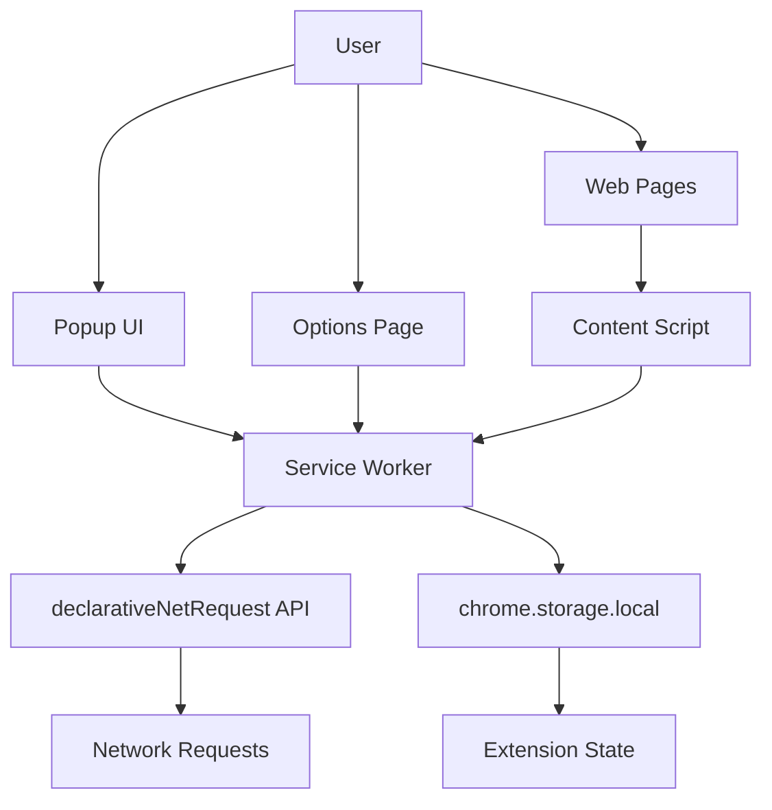

# AdBusters Chrome Extension - Design Document

## Overview

AdBusters is a Manifest V3 Chrome extension that blocks advertisements using declarativeNetRequest and provides a Halloween-themed user experience. The architecture follows Chrome extension best practices with a service worker for background logic, content scripts for page manipulation, and Svelte-based UI components for the popup and options pages.

The extension is built with TypeScript, Vite, Svelte, and Tailwind CSS to enable rapid development suitable for a hackathon timeline.

## Architecture

### High-Level Architecture



### Component Interaction Flow

1. **User toggles blocking** → Popup UI → Service Worker → Updates declarativeNetRequest rules
2. **Ad request made** → declarativeNetRequest blocks request → Service Worker increments counter
3. **Page loads** → Content Script scans DOM → Hides ad elements → Injects ghost SVGs
4. **User opens popup** → Retrieves state from storage → Displays ghost count and PKE meter

### Build System

- **Vite** compiles TypeScript and Svelte components
- **Rollup** (via Vite) bundles service worker and content scripts separately
- **Tailwind CSS** processes styles with custom theme configuration
- **Output**: `dist/` directory with manifest.json and all assets ready for Chrome

## Components and Interfaces

### 1. Service Worker (`src/background/service-worker.ts`)

**Responsibilities:**

- Manage extension state (blocking enabled/disabled, ghost count)
- Register and update declarativeNetRequest rules
- Listen for blocked requests and update counters
- Handle messages from popup and content scripts
- Manage icon badge and appearance

**Key Functions:**

```typescript
interface ServiceWorkerAPI {
  toggleBlocking(enabled: boolean): Promise<void>;
  updateGhostCount(increment: number): Promise<number>;
  getState(): Promise<ExtensionState>;
  updateRules(aggressive: boolean): Promise<void>;
  checkWhitelist(domain: string): Promise<boolean>;
}

interface ExtensionState {
  blockingEnabled: boolean;
  ghostCount: number;
  aggressiveMode: boolean;
  soundEnabled: boolean;
  whitelist: string[];
}
```

**Chrome APIs Used:**

- `chrome.declarativeNetRequest` - Register/update blocking rules
- `chrome.storage.local` - Persist extension state
- `chrome.action` - Update icon badge with ghost count
- `chrome.runtime.onMessage` - Handle messages from other components

### 2. Content Script (`src/content/content-script.ts`)

**Responsibilities:**

- Inject CSS to hide advertisement elements
- Scan DOM for ad elements using selectors
- Replace hidden ads with ghost/trap SVG graphics
- Maintain page layout integrity
- Report blocked ads to service worker

**Key Functions:**

```typescript
interface ContentScriptAPI {
  scanForAds(): void;
  hideAdElement(element: HTMLElement): void;
  injectGhostGraphic(element: HTMLElement): void;
  applyBlockingCSS(): void;
}
```

**Ad Detection Selectors:**

```css
/* Common ad element selectors */
[id*="ad-"], [class*="ad-"], [id*="banner"],
.advertisement, #sponsored-content,
iframe[src*="doubleclick"], iframe[src*="googlesyndication"]
```

**Chrome APIs Used:**

- `chrome.runtime.sendMessage` - Report blocked ads to service worker

### 3. Popup UI (`src/ui/popup.svelte`)

**Responsibilities:**

- Display large toggle button for blocking on/off
- Show ghost counter with emoji
- Render animated PKE Meter
- Provide "Cross the Streams" aggressive mode toggle
- Apply spooky theme styling

**Component Structure:**

```svelte
<script lang="ts">
  import { onMount } from 'svelte'

  let blockingEnabled = false
  let ghostCount = 0
  let aggressiveMode = false
  let pkeLevel = 0

  async function toggleBlocking() { /* ... */ }
  async function toggleAggressive() { /* ... */ }
  async function loadState() { /* ... */ }
</script>

<div class="popup-container">
  <h1>AdBusters 👻</h1>
  <button on:click={toggleBlocking}>
    {blockingEnabled ? 'Trap Ads 👻' : 'Start Trapping'}
  </button>
  <div class="ghost-counter">
    Ghosts Trapped: {ghostCount}
  </div>
  <PKEMeter level={pkeLevel} />
  <label>
    <input type="checkbox" bind:checked={aggressiveMode} on:change={toggleAggressive} />
    Cross the Streams ⚡
  </label>
</div>
```

**Styling:**

- Tailwind classes with custom theme colors
- Pumpkin orange (#FF6B35), neon green (#39FF14), spectral blue (#00D9FF)
- Glowing effects using CSS box-shadow
- Animations for PKE meter using CSS transitions

### 4. Options Page (`src/ui/options.svelte`)

**Responsibilities:**

- Toggle sound effects on/off
- Manage whitelist (add/remove domains)
- Display current settings
- Provide "Refresh Ghost Data" button

**Component Structure:**

```svelte
<script lang="ts">
  let soundEnabled = true
  let whitelist: string[] = []
  let newDomain = ''

  async function toggleSound() { /* ... */ }
  async function addDomain() { /* ... */ }
  async function removeDomain(domain: string) { /* ... */ }
  async function refreshData() { /* ... */ }
</script>

<div class="options-container">
  <h1>AdBusters Settings</h1>

  <section>
    <h2>Sound Effects</h2>
    <label>
      <input type="checkbox" bind:checked={soundEnabled} on:change={toggleSound} />
      Enable trap sounds
    </label>
  </section>

  <section>
    <h2>Whitelisted Domains</h2>
    <input bind:value={newDomain} placeholder="example.com" />
    <button on:click={addDomain}>Add</button>
    <ul>
      {#each whitelist as domain}
        <li>{domain} <button on:click={() => removeDomain(domain)}>Remove</button></li>
      {/each}
    </ul>
  </section>

  <button on:click={refreshData}>Refresh Ghost Data</button>
</div>
```

### 5. Filter Rules (`src/rules/baseRules.json`)

**Structure:**

```json
[
  {
    "id": 1,
    "priority": 1,
    "action": { "type": "block" },
    "condition": {
      "urlFilter": "*doubleclick.net*",
      "resourceTypes": ["script", "image", "sub_frame"]
    }
  },
  {
    "id": 2,
    "priority": 1,
    "action": { "type": "block" },
    "condition": {
      "urlFilter": "*googlesyndication.com*",
      "resourceTypes": ["script", "image", "sub_frame"]
    }
  }
]
```

**Rule Generation:**

- Node.js script (`tools/fetch-lists.ts`) fetches EasyList subset
- Converts filter syntax to declarativeNetRequest format
- Outputs to `baseRules.json`
- Aggressive rules stored separately for "Cross the Streams" mode

### 6. Build Tool (`tools/fetch-lists.ts`)

**Responsibilities:**

- Fetch EasyList filter rules from CDN
- Parse filter syntax
- Convert to declarativeNetRequest JSON format
- Generate baseRules.json and aggressiveRules.json
- Run during build process

**Key Functions:**

```typescript
interface FilterTool {
  fetchEasyList(): Promise<string>;
  parseFilters(content: string): Filter[];
  convertToDeclarativeRules(filters: Filter[]): DeclarativeRule[];
  writeRulesFile(rules: DeclarativeRule[], path: string): Promise<void>;
}
```

## Data Models

### Extension State (chrome.storage.local)

```typescript
interface StoredState {
  blockingEnabled: boolean; // Is blocking currently active
  ghostCount: number; // Total ads blocked
  aggressiveMode: boolean; // Is "Cross the Streams" enabled
  soundEnabled: boolean; // Are sound effects enabled
  whitelist: string[]; // Domains where blocking is disabled
  lastUpdated: number; // Timestamp of last state update
}
```

### Message Protocol

Messages between components use Chrome's runtime messaging:

```typescript
type Message =
  | { type: "GET_STATE" }
  | { type: "TOGGLE_BLOCKING"; enabled: boolean }
  | { type: "TOGGLE_AGGRESSIVE"; enabled: boolean }
  | { type: "INCREMENT_GHOST_COUNT"; count: number }
  | { type: "UPDATE_WHITELIST"; whitelist: string[] }
  | { type: "TOGGLE_SOUND"; enabled: boolean }
  | { type: "PLAY_SOUND"; soundName: string };

interface MessageResponse {
  success: boolean;
  data?: any;
  error?: string;
}
```

### Declarative Net Request Rules

```typescript
interface DeclarativeRule {
  id: number;
  priority: number;
  action: {
    type: "block" | "allow" | "redirect";
  };
  condition: {
    urlFilter?: string;
    regexFilter?: string;
    resourceTypes?: ResourceType[];
    domains?: string[];
    excludedDomains?: string[];
  };
}

type ResourceType =
  | "script"
  | "image"
  | "stylesheet"
  | "sub_frame"
  | "xmlhttprequest";
```

## Error Handling

### Service Worker Errors

```typescript
async function safeStorageGet<T>(key: string, defaultValue: T): Promise<T> {
  try {
    const result = await chrome.storage.local.get(key);
    return result[key] ?? defaultValue;
  } catch (error) {
    console.error(`Storage get failed for ${key}:`, error);
    return defaultValue;
  }
}

async function safeRuleUpdate(rules: DeclarativeRule[]): Promise<boolean> {
  try {
    await chrome.declarativeNetRequest.updateDynamicRules({
      removeRuleIds: rules.map((r) => r.id),
      addRules: rules,
    });
    return true;
  } catch (error) {
    console.error("Rule update failed:", error);
    return false;
  }
}
```

### Content Script Errors

```typescript
function safeQuerySelector(selector: string): HTMLElement[] {
  try {
    return Array.from(document.querySelectorAll(selector));
  } catch (error) {
    console.warn(`Invalid selector: ${selector}`, error);
    return [];
  }
}

function safeInjectGhost(element: HTMLElement): void {
  try {
    const ghost = createGhostSVG();
    element.replaceWith(ghost);
  } catch (error) {
    console.warn("Failed to inject ghost:", error);
    // Fallback: just hide the element
    element.style.display = "none";
  }
}
```

### UI Error Handling

```svelte
<script>
  let errorMessage = ''

  async function handleAction() {
    try {
      errorMessage = ''
      await performAction()
    } catch (error) {
      errorMessage = 'Something went wrong. Try again!'
      console.error(error)
    }
  }
</script>

{#if errorMessage}
  <div class="error-banner">{errorMessage}</div>
{/if}
```

## Testing Strategy

### Unit Testing

**Service Worker Logic:**

- Test state management functions
- Test rule generation and updates
- Test whitelist checking logic
- Mock chrome APIs using jest-chrome

**Content Script Logic:**

- Test ad detection selectors
- Test ghost injection without DOM
- Test CSS injection logic

**UI Components:**

- Test Svelte component rendering
- Test user interactions (button clicks, toggles)
- Test state updates
- Use @testing-library/svelte

### Integration Testing

**Extension Flow:**

1. Load extension in Chrome test environment
2. Navigate to test page with known ad elements
3. Verify ads are blocked via network inspection
4. Verify ghost graphics appear in DOM
5. Verify popup displays correct ghost count

**Storage Persistence:**

1. Set extension state
2. Reload extension
3. Verify state persists correctly

### Manual Testing

**Demo Checklist:**

- [ ] Load extension in Chrome
- [ ] Visit ad-heavy site (news site, blog)
- [ ] Toggle blocking on/off
- [ ] Verify ghost counter increments
- [ ] Verify PKE meter animates
- [ ] Enable "Cross the Streams" mode
- [ ] Verify sound plays (if enabled)
- [ ] Add domain to whitelist
- [ ] Verify blocking disabled on whitelisted domain
- [ ] Check icon badge shows ghost count
- [ ] Verify spooky theme renders correctly

### Performance Considerations

- Content script should scan DOM efficiently (use MutationObserver for dynamic content)
- Limit number of declarativeNetRequest rules to < 5000 (Chrome limit is 30,000)
- Debounce ghost count updates to avoid excessive storage writes
- Use CSS animations instead of JavaScript for PKE meter
- Lazy load sound files only when needed

## Visual Design Specifications

### Color Palette

```css
:root {
  --pumpkin-orange: #ff6b35;
  --neon-green: #39ff14;
  --spectral-blue: #00d9ff;
  --dark-bg: #1a1a1a;
  --ghost-white: #f0f0f0;
}
```

### Typography

- Font family: System font stack with fallback to sans-serif
- Headings: Bold, uppercase for emphasis
- Body: Regular weight, readable size (14-16px)

### Animations

**PKE Meter:**

```css
.pke-meter {
  width: 100%;
  height: 20px;
  background: var(--dark-bg);
  border: 2px solid var(--neon-green);
  border-radius: 10px;
  overflow: hidden;
}

.pke-meter-fill {
  height: 100%;
  background: linear-gradient(90deg, var(--neon-green), var(--spectral-blue));
  transition: width 0.3s ease-out;
  box-shadow: 0 0 10px var(--neon-green);
}
```

**Glow Effect:**

```css
.glow {
  box-shadow: 0 0 20px var(--neon-green), 0 0 40px var(--neon-green),
    0 0 60px var(--neon-green);
  animation: pulse 2s infinite;
}

@keyframes pulse {
  0%,
  100% {
    opacity: 1;
  }
  50% {
    opacity: 0.7;
  }
}
```

### Ghost SVG

```svg
<svg viewBox="0 0 100 100" class="ghost-icon">
  <path d="M50 20 C30 20 20 30 20 50 L20 80 L30 70 L40 80 L50 70 L60 80 L70 70 L80 80 L80 50 C80 30 70 20 50 20 Z"
        fill="var(--ghost-white)"
        stroke="var(--spectral-blue)"
        stroke-width="2"/>
  <circle cx="40" cy="45" r="5" fill="var(--dark-bg)"/>
  <circle cx="60" cy="45" r="5" fill="var(--dark-bg)"/>
</svg>
```

## Development Workflow

### Setup

```bash
npm install
npm run dev
```

### Build Process

1. Vite compiles TypeScript to JavaScript
2. Svelte components compiled to vanilla JS
3. Tailwind processes CSS with custom theme
4. Assets copied to dist/
5. manifest.json copied to dist/
6. Service worker and content script bundled separately

### Loading in Chrome

1. Open `chrome://extensions`
2. Enable "Developer mode"
3. Click "Load unpacked"
4. Select `dist/` directory
5. Extension appears in toolbar

### Hot Reload

- Vite watches for file changes
- Rebuilds automatically
- Manual extension reload required in Chrome (or use extension-reloader package)

## Security Considerations

- Use Content Security Policy in manifest.json
- Sanitize user input for whitelist domains
- Validate message sources in service worker
- Use HTTPS for fetching filter lists
- Limit host_permissions to necessary domains
- No eval() or inline scripts (Manifest V3 requirement)

## Deployment

### Build for Production

```bash
npm run build
```

### Package Extension

```bash
cd dist
zip -r adbusters.zip .
```

### Chrome Web Store (Optional)

1. Create developer account
2. Upload adbusters.zip
3. Fill in store listing details
4. Submit for review

### Hackathon Demo

- Load unpacked extension from dist/
- Prepare demo site with visible ads
- Have backup recording in case of live demo issues
- Prepare talking points about tech stack and features
